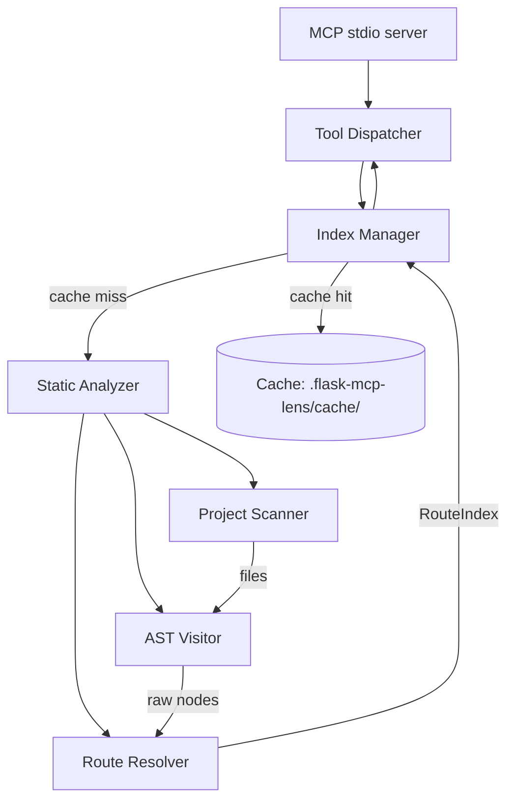
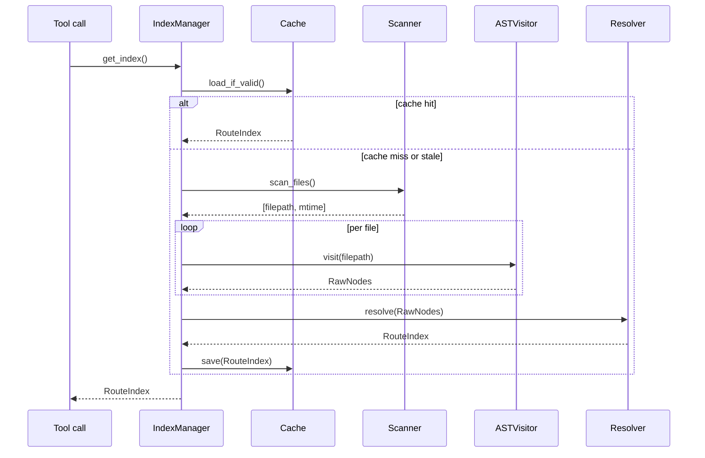
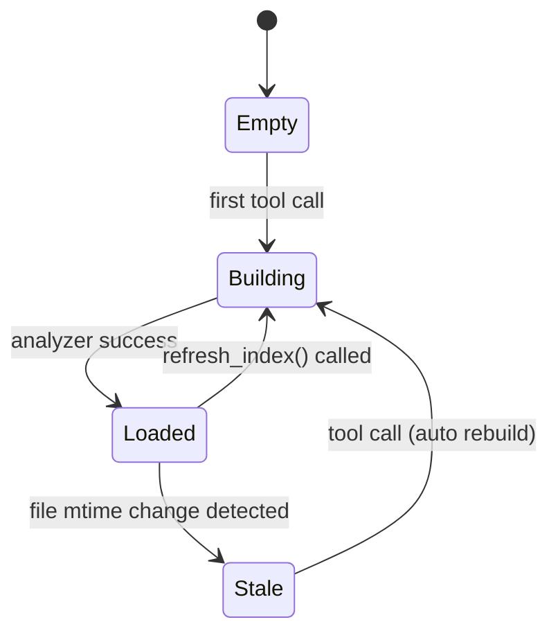

# flask-mcp-lens Phase 1 設計書（MVP）

ステータス: ドラフト v1.0
対応要件: [requirements.md](./requirements.md) §3.2, §9 Phase 1
想定工数: 1.5 人日（約 12h）

---

## 目次

- [1. スコープ](#1-スコープ)
- [2. アーキテクチャ](#2-アーキテクチャ)
- [3. ディレクトリ構成](#3-ディレクトリ構成)
- [4. データモデル](#4-データモデル)
- [5. 解析パイプライン](#5-解析パイプライン)
- [6. ツール仕様](#6-ツール仕様)
- [7. キャッシュ設計](#7-キャッシュ設計)
- [8. エラー処理とエッジケース](#8-エラー処理とエッジケース)
- [9. テスト設計](#9-テスト設計)
- [10. 配布・起動](#10-配布起動)
- [11. Phase 1 で意図的にやらないこと](#11-phase-1-で意図的にやらないこと)

---

## 1. スコープ

Phase 1 は**静的解析のみ**で動作する MCP サーバを完成させる。提供するツールは 4 つ:

| ツール | 主用途 |
|--------|--------|
| `find_app_factory()` | app の入口探索 |
| `get_app_overview()` | 構成サマリ |
| `list_routes(filter?)` | 全ルート列挙 |
| `get_route_handler(url, method)` | 実行チェーン可視化 |
| `refresh_index()` | キャッシュ無効化と再解析 |

**Out of Phase 1**: ハイブリッド実行、認証判定、Blueprint の登録/未登録判定、拡張ライブラリ詳細、watchdog、設定ファイル `.flask-mcp-lens.toml`、`MethodView`、Class-based view、信頼度スコア。

---

## 2. アーキテクチャ



**プロセス境界**:

- 1 プロセス、シングルスレッド。
- MCP は stdio。LLM エージェントが起動する。
- 解析中も MCP リクエストは受け付けるが、index 待ちのツールは解析完了までブロック（5.3 の判断 C）。

**主要モジュール**:

| モジュール | 責務 |
|-----------|------|
| `flask_mcp_lens.server` | MCP stdio エントリポイント、ツール登録 |
| `flask_mcp_lens.tools` | 各ツール実装（thin wrapper、Index への問い合わせ）|
| `flask_mcp_lens.index` | `IndexManager`：キャッシュ管理 + 遅延ロード |
| `flask_mcp_lens.analyzer.scanner` | ファイル列挙、除外フィルタ |
| `flask_mcp_lens.analyzer.ast_visitor` | AST から Flask 関連ノード抽出 |
| `flask_mcp_lens.analyzer.resolver` | 抽出ノードを `RouteIndex` に変換 |
| `flask_mcp_lens.models` | dataclass（`Route`, `Blueprint`, `BeforeRequest` 等）|
| `flask_mcp_lens.cache` | gzip+JSON キャッシュ I/O |
| `flask_mcp_lens.urlmap` | 軽量 URL マッチング |

---

## 3. ディレクトリ構成

```
flask-mcp-lens/
├── pyproject.toml
├── README.md
├── src/
│   └── flask_mcp_lens/
│       ├── __init__.py
│       ├── __main__.py            # `python -m flask_mcp_lens`
│       ├── server.py              # MCP server entrypoint
│       ├── tools/
│       │   ├── __init__.py
│       │   ├── find_app_factory.py
│       │   ├── get_app_overview.py
│       │   ├── list_routes.py
│       │   ├── get_route_handler.py
│       │   └── refresh_index.py
│       ├── index.py
│       ├── cache.py
│       ├── urlmap.py
│       ├── models.py
│       └── analyzer/
│           ├── __init__.py
│           ├── scanner.py
│           ├── ast_visitor.py
│           ├── resolver.py
│           └── imports.py         # import エイリアス解析
└── tests/
    ├── conftest.py
    ├── fixtures/
    │   ├── single_app/            # case (a)
    │   ├── factory_one_bp/        # case (b)
    │   └── factory_nested_bp/     # case (c)
    ├── unit/
    │   ├── test_ast_visitor.py
    │   ├── test_resolver.py
    │   ├── test_urlmap.py
    │   └── test_cache.py
    └── integration/
        ├── test_tools_smoke.py
        └── test_e2e_mcp.py
```

**配布パッケージ名**: `flask-mcp-lens`、import 名: `flask_mcp_lens`、CLI: `flask-mcp-lens`（`pyproject.toml` の `[project.scripts]` で設定）。

---

## 4. データモデル

`models.py` に dataclass で定義。すべて `frozen=True` でイミュータブル（キャッシュの整合性を保つため）。

```python
from dataclasses import dataclass
from typing import Literal, Optional

@dataclass(frozen=True)
class SourceLoc:
    file: str            # プロジェクトルートからの相対パス、forward slash
    line: int            # 1-based
    col: int = 0

@dataclass(frozen=True)
class Decorator:
    name: str            # "@" を含まない、ドット区切り名 ("auth.login_required")
    location: SourceLoc

@dataclass(frozen=True)
class BeforeRequestHook:
    function_name: str
    location: SourceLoc
    scope: str           # "app" or "blueprint:<name>"

@dataclass(frozen=True)
class ViewFunction:
    name: str
    qualname: str        # "module.path.ClassName.method" or "module.path.func"
    location: SourceLoc
    decorators: tuple[Decorator, ...]
    source_excerpt: str  # 関数定義行 + 続く 5 行（ツール側で truncate）

@dataclass(frozen=True)
class Route:
    url: str             # url_prefix を結合済み ("/api/v1/users/<id>")
    methods: tuple[str, ...]   # 大文字、ソート済み ("DELETE", "GET")
    endpoint: str        # Flask の endpoint 名 ("users_api.get_user")
    blueprint: Optional[str]   # Blueprint 名 or None
    view: ViewFunction
    definition: SourceLoc      # @route デコレータの位置

@dataclass(frozen=True)
class BlueprintDef:
    name: str
    file: SourceLoc
    url_prefix: Optional[str]  # 定義時の prefix
    parent: Optional[str]      # 親 Blueprint 名（入れ子の場合）
    registrations: tuple["BlueprintRegistration", ...]

@dataclass(frozen=True)
class BlueprintRegistration:
    location: SourceLoc        # register_blueprint 呼び出し位置
    url_prefix_override: Optional[str]  # register_blueprint(url_prefix=...)

@dataclass(frozen=True)
class AppFactoryCandidate:
    kind: Literal["factory_function", "module_level_app"]
    name: str            # "create_app" or "app"
    location: SourceLoc
    params: tuple[str, ...]
    confidence: Literal["high", "medium", "low"]

@dataclass(frozen=True)
class RouteIndex:
    schema_version: str = "1"
    project_root: str
    analyzed_at: float           # Unix timestamp
    file_mtimes: dict[str, float]  # 相対パス → mtime
    app_factories: tuple[AppFactoryCandidate, ...]
    selected_factory: int        # app_factories のインデックス
    blueprints: tuple[BlueprintDef, ...]
    routes: tuple[Route, ...]
    before_request_hooks: tuple[BeforeRequestHook, ...]
    warnings: tuple[str, ...]
```

**フィールド命名の注意**:

- パスは常に forward slash（Windows 対応）。OS 境界では `pathlib.PurePosixPath` で正規化。
- `methods` は文字列タプル。`Set` ではなくソート済みタプルを使う理由はキャッシュ JSON 化時の決定性。

---

## 5. 解析パイプライン



### 5.1 Scanner

**入力**: プロジェクトルート（cwd か `--root` 引数）
**出力**: 解析対象ファイルパス一覧

**ロジック**:

1. ルートを起点に `**/*.py` を `os.walk` で再帰列挙
2. 以下のディレクトリを除外:
   - `.git`, `.venv`, `venv`, `env`, `.env`, `__pycache__`, `node_modules`, `.tox`, `.mypy_cache`, `.pytest_cache`, `.flask-mcp-lens`, `build`, `dist`
   - 名前が `.` で始まる隠しディレクトリ
3. 以下のファイルパターンを除外（前提 A5）:
   - `tests/**`, `test/**`, `**/test_*.py`, `**/*_test.py`, `conftest.py`
4. ファイルサイズ > 1MB の Python ファイルは warning を出してスキップ（生成コードや巨大マイグレーションを排除）
5. UTF-8 として読めないファイルはスキップ（warning）

**設定での上書き**: Phase 1 は環境変数 `FLASK_MCP_LENS_EXCLUDE` （カンマ区切りグロブ）で追加除外のみ受ける。`.flask-mcp-lens.toml` は Phase 2。

### 5.2 ASTVisitor

各ファイルを `ast.parse(source, filename)` でパースし、以下を抽出:

| 検出対象 | AST ノード | キャプチャ内容 |
|---------|-----------|--------------|
| `Flask(__name__)` 呼び出し | `Assign` 右辺が `Call` で `func.id == "Flask"` | 変数名、位置 |
| `create_app` 等 factory 関数 | `FunctionDef` の本体に `Flask(...)` 呼び出しを含むもの | 関数名、引数、位置 |
| `Blueprint(...)` 呼び出し | `Assign` 右辺が `Call` で `func.id == "Blueprint"` | 変数名、name 引数、url_prefix 引数、位置 |
| `@app.route(...)`, `@bp.route(...)` | `FunctionDef.decorator_list` 内の `Call` で `func.attr == "route"` | URL、methods、endpoint、デコレートされた関数 |
| `app.add_url_rule(...)` | 任意箇所の `Call` で `func.attr == "add_url_rule"` | rule、view_func、methods、endpoint |
| `app.register_blueprint(...)` | 任意箇所の `Call` で `func.attr == "register_blueprint"` | bp 名、url_prefix override |
| `@app.before_request`, `@bp.before_request` | `FunctionDef.decorator_list` 内 | 関数、スコープ |
| `app.before_request(func)` | 任意箇所の `Call` で `func.attr == "before_request"` の引数 | 関数名 |
| import 文 | `Import`, `ImportFrom` | 完全修飾名、エイリアス |

**実装**: `ast.NodeVisitor` を継承した単一クラス `FlaskASTVisitor`。ファイル単位で `visit()` を呼び、各ハンドラ（`visit_FunctionDef`, `visit_Call`, `visit_Assign`, `visit_Import`, `visit_ImportFrom`）が結果を `self.results` に蓄積。

**import エイリアス追跡** (`analyzer/imports.py`):

- `from flask import Blueprint as BP` → このファイル内で `BP(...)` を `Blueprint(...)` 呼び出しとして扱う
- `from flask import Blueprint` → `Blueprint(...)` のまま
- `import flask` → `flask.Blueprint(...)` をマッチ
- ファイル単位でエイリアスマップを構築し、Visitor 各メソッドで参照

### 5.3 Resolver

各ファイルから集めた `RawNodes`（モジュール変数、Blueprint インスタンス、register_blueprint 呼び出し、route デコレータ）を統合し、`RouteIndex` を構築する。

**ロジック**:

1. **Blueprint 解決**:
   - 全ファイルから `Blueprint(...)` 代入を集める
   - 同名 Blueprint が複数定義されている場合は warning を出し、最初に見つかったものを採用
   - `register_blueprint` 呼び出しを集め、各 Blueprint に紐付け
   - 入れ子: `parent_bp.register_blueprint(child_bp)` を検出（Phase 1 では入れ子は最大 2 段、3 段以上は warning）

2. **ルート解決**:
   - 各 view 関数のデコレータから `route` を抽出
   - 関数が属するモジュール変数（`app` か `bp` か）を判定
   - URL: Blueprint の場合 `bp.url_prefix + route_url`、入れ子なら親も結合
   - methods: `methods=["GET", "POST"]` から取得、未指定なら `("GET",)`
   - endpoint: 明示指定がなければ `view_func.__name__`、Blueprint の場合 `<bp_name>.<view_func.__name__>`

3. **before_request チェーン構築**:
   - 各 hook の scope を判定（app or blueprint）
   - ルートに対して、適用される hook を順序付きで列挙する処理は `get_route_handler` 側で実行（事前計算しない、ペイロードが大きくなるため）

4. **不確実性の記録**:
   - 動的な url_prefix（`url_prefix=os.environ.get("PREFIX")` 等）を検出したら warning に「動的 url_prefix 検出: <ファイル:行>」を追加し、当該 Blueprint の url_prefix は `null` にする
   - 解決できない `add_url_rule` の view_func（lambda、未解決名）は warning + skip

### 5.4 URLMap (`urlmap.py`)

軽量 URL マッチング。Werkzeug は使わない（要件 §3.2.4 の判断）。

**サポートするコンバータ**:

- `<name>` → 任意文字列（`/` を除く）
- `<int:name>` → 整数
- `<float:name>` → 浮動小数
- `<path:name>` → 任意文字列（`/` 含む）
- `<uuid:name>` → UUID 形式
- `<string:name>` → `<name>` と同等

**マッチング**:

```python
def match(rule: str, method: str, request_url: str, request_method: str) -> bool:
    # 1. method 一致確認
    # 2. rule を正規表現に変換（コンバータごとに対応パターン）
    # 3. request_url 全体マッチ
```

**末尾 slash の扱い**: Flask の strict_slashes はデフォルト True。Phase 1 では完全一致のみ（リダイレクト挙動は再現しない、warning に注記）。

---

## 6. ツール仕様

各ツールは `dict` を返し、MCP server がそれを JSON 文字列化する。共通エンベロープ:

```python
def envelope(tool_name: str, data: dict, warnings: list[str] = None) -> dict:
    return {
        "tool": tool_name,
        "version": "1.0",
        "analysis_mode": "static",
        "warnings": warnings or [],
        "data": data,
    }
```

### 6.1 `find_app_factory`

**MCP 名**: `find_app_factory`
**説明**: "Locate the Flask Application Factory or top-level Flask() instantiation."
**入力スキーマ**: なし

**実装**:

```python
def find_app_factory() -> dict:
    index = index_manager.get()
    return envelope("find_app_factory", {
        "candidates": [
            {
                "kind": c.kind,
                "name": c.name,
                "file": c.location.file,
                "line": c.location.line,
                "params": list(c.params),
                "confidence": c.confidence,
            }
            for c in index.app_factories
        ],
        "selected": index.selected_factory,
    })
```

**信頼度判定**:

- `Flask(__name__)` 直書き、変数名 `app` → high
- `create_app`, `make_app`, `app_factory` の名前を持ち、本体に `Flask(...)` を含む関数 → high
- `Flask(...)` を返す任意関数 → medium
- `Flask(...)` を含むが返さない関数 → low

複数候補がある場合 selected の優先順:

1. `Flask(__name__)` の module-level 代入で変数名 `app`
2. `create_app` という名前の関数
3. confidence 順

### 6.2 `get_app_overview`

**入力**: なし
**出力**:

```jsonc
{
  "data": {
    "app_factory": { "file": "app/__init__.py", "line": 14, "kind": "factory_function", "name": "create_app" },
    "blueprint_count": 12,
    "route_count": 87,
    "extensions_detected": [],          // Phase 2 で実装、Phase 1 は常に空配列
    "auth_strategies_summary": null,     // Phase 2 で追加
    "summary_markdown": "## アプリ概要\n\n- App factory: `create_app` (`app/__init__.py:14`)\n- Blueprint: 12 個\n- ルート: 87 件\n\n*認証検出は Phase 2 で対応*"
  }
}
```

**Markdown 生成**: テンプレート文字列で組み立て、解析失敗箇所があれば「⚠️ 解析できなかったファイル: X 件」セクションを追加。

### 6.3 `list_routes`

**入力スキーマ**:

```jsonc
{
  "type": "object",
  "properties": {
    "filter": {
      "type": "object",
      "properties": {
        "url_prefix": { "type": "string" },
        "method": { "type": "string", "enum": ["GET", "POST", "PUT", "DELETE", "PATCH", "HEAD", "OPTIONS"] },
        "blueprint": { "type": "string" }
      }
    }
  }
}
```

**出力**:

```jsonc
{
  "data": {
    "routes": [
      {
        "url": "/api/v1/users/<int:id>",
        "methods": ["DELETE", "GET"],
        "endpoint": "users_api.get_user",
        "view_function": "get_user",
        "blueprint": "users_api",
        "definition": { "file": "app/api/users.py", "line": 23 },
        "decorators": ["jwt_required"]
      }
    ],
    "total": 1,
    "filtered_from": 87
  }
}
```

**フィルタ適用順**: blueprint → url_prefix → method の順で AND。

### 6.4 `get_route_handler`

**入力スキーマ**:

```jsonc
{
  "type": "object",
  "properties": {
    "url": { "type": "string" },
    "method": { "type": "string", "default": "GET" }
  },
  "required": ["url"]
}
```

**処理フロー**:

1. `index.routes` を走査し、`urlmap.match(route.url, route.methods, url, method)` で一致するルートを探す
2. 見つからなければ `{"error": "no matching route", "suggestions": [...]}` を返す（最も近い prefix を 3 件まで提案）
3. 見つかった場合、execution_chain を構築:
   - app スコープの `before_request_hooks`（定義順）
   - blueprint スコープの `before_request_hooks`（route が属する BP のもの、入れ子なら親 BP のものも含む）
   - route の decorators（外側 → 内側、ソースに書かれた順の逆）
   - view_function の本体抜粋（最大 5 行）

**出力**: 要件 §3.2.4 に記載の形式と同一。

**エッジケース**:

- 同一 URL+method に複数ルートがマッチ（同名関数が別 BP 経由で登録）→ warning + 全件返す
- view 関数のソースが取れない（外部モジュールから import された関数）→ `source_excerpt: null`、warning

### 6.5 `refresh_index`

**入力**: なし
**出力**: `{"refreshed": true, "duration_ms": 1234, "route_count": 87}`

**処理**: `IndexManager.invalidate()` → 次回 `get()` でフルリビルド。本ツールは「即座にリビルドして待機」する（呼び出し時点で完了させたい意図）。

---

## 7. キャッシュ設計

**保存先**: `<project_root>/.flask-mcp-lens/cache/index-v1.json.gz`

**ライフサイクル**:



**有効性チェック** (`IndexManager._is_valid`):

1. キャッシュファイルが存在する
2. JSON が読める、`schema_version == "1"`
3. `index.file_mtimes` の各ファイルの現在 mtime が一致
4. **追加検出**: 現在のスキャンで検出されるファイル集合がキャッシュと一致（ファイル追加/削除を検知）

いずれか失敗で全体リビルド。

**書き込み**: 一時ファイル `index-v1.json.gz.tmp` に書いて `os.replace`（途中クラッシュ耐性）。

**サイズ管理**: gzip 圧縮で 10 万行プロジェクト想定 5MB 以内。閾値超過 (50MB) で warning。

**並行性**: Phase 1 は単一プロセスのみ想定。同一プロジェクトで MCP サーバを 2 つ起動するケースはサポートしない（双方が書き換えると壊れる）。ファイルロック (`fcntl` / `msvcrt`) は Phase 3 で。

---

## 8. エラー処理とエッジケース

| 状況 | 対応 |
|------|------|
| プロジェクトに 1 つも `Flask(...)` がない | `find_app_factory` の `candidates` が空、`selected` が `null`。他ツールは `routes` 等が空配列で返る。warning に「Flask app 未検出」 |
| 構文エラーのある Python ファイル | スキップ + warning「<file>: 構文エラー」。他ファイルの解析は続行 |
| 循環 import 様の状況（resolver で名前解決できず）| 当該ルートを skip + warning |
| `add_url_rule` の view_func が動的（変数）で解決できない | skip + warning |
| 巨大ファイル (>1MB) | スキップ + warning（5.1） |
| Blueprint name 衝突 | 最初に見つかったものを採用 + warning |
| キャッシュ書き込み失敗（権限なし）| メモリ上にだけ保持、warning「キャッシュ書き込み失敗、起動毎に再解析」 |
| MCP プロトコルエラー | mcp SDK の例外をそのまま伝搬 |
| 解析スレッド中の予期せぬ例外 | tool レスポンスは `{"error": "...", "traceback": "..."}` を返し、index は前回成功状態を保持 |

**warning 構造**: 各 warning は文字列。重複は除去（`set` でユニーク化してから `list` 化、決定性のため `sorted`）。

---

## 9. テスト設計

### 9.1 Fixture プロジェクト

`tests/fixtures/` に 3 つの最小 Flask アプリを置く。それぞれ実際に `flask run` で動くもの（解析側だけのモックにしない、実プロジェクトの形を維持）:

**(a) `single_app/`**: `app.py` 1 ファイル、`app = Flask(__name__)` 直書き、ルート 3 つ、`@app.before_request` 1 つ。

**(b) `factory_one_bp/`**:
- `app/__init__.py` に `create_app()`
- `app/views.py` に Blueprint `main_bp`、ルート 5 つ
- `before_request` を app と bp の両スコープに配置

**(c) `factory_nested_bp/`**:
- `app/__init__.py` に `create_app()`
- `app/api/__init__.py` に親 BP `api_v1`
- `app/api/users.py`, `app/api/posts.py` に子 BP `users_api`, `posts_api`
- 親 BP に登録、`api_v1` を `create_app` で登録
- 入れ子 url_prefix `/api/v1/users/...` の解決を検証

### 9.2 ユニットテスト

| テスト対象 | 検証観点 |
|-----------|----------|
| `urlmap.match` | 各コンバータ、末尾 slash、method 不一致、複数コンバータ混在 |
| `imports.AliasMap` | `as` 別名、ドット区切り、relative import |
| `ast_visitor.FlaskASTVisitor` | 各検出対象 1 ケースずつ |
| `resolver.resolve` | 入れ子 BP の url_prefix 結合、endpoint 自動生成 |
| `cache` | save/load の往復、mtime 不一致時の invalidate、tmp ファイル経由の atomic write |
| `index.IndexManager` | 並行 `get()` 呼び出し中の二重ビルド防止（Lock）|

### 9.3 統合テスト

- `test_tools_smoke.py`: 各ツールを 3 fixture 全てで呼び、構造が JSON Schema に適合することを `jsonschema` で検証
- `test_e2e_mcp.py`: subprocess で MCP server を起動し、stdio 経由で `list_tools` → `call_tool("list_routes")` → 結果検証

### 9.4 ゴールデンテスト

各 fixture について `expected/list_routes.json`, `expected/get_app_overview.json` を git 管理し、出力との diff を取る。decorator 追加等で簡単に再生成できるよう `--update` フラグ付き runner を用意。

### 9.5 性能ベンチマーク（Phase 1 では smoke 程度）

`tests/perf/test_smoke.py` に「fixture (c) で `list_routes` が 500ms 以内」という assertion を入れる。CI で実行。詳細プロファイリングは Phase 2 以降。

---

## 10. 配布・起動

### 10.1 `pyproject.toml`

```toml
[project]
name = "flask-mcp-lens"
version = "0.1.0"
requires-python = ">=3.10"
dependencies = [
    "mcp>=0.9",       # 実際のバージョンは実装時に最新を確認
]

[project.scripts]
flask-mcp-lens = "flask_mcp_lens.server:main"
```

**依存方針**: Phase 1 は `mcp` SDK のみ。`watchdog`, `tomli`, `werkzeug` は依存に入れない。

### 10.2 起動

```bash
# Claude Code の MCP 設定例
{
  "mcpServers": {
    "flask-mcp-lens": {
      "command": "flask-mcp-lens",
      "args": ["--root", "/path/to/flask/project"]
    }
  }
}
```

`--root` 省略時は cwd。

### 10.3 ロギング

- stdio に出力すると MCP プロトコルが破壊される。**stderr** に書く
- 環境変数 `FLASK_MCP_LENS_LOG=debug` でレベル切り替え
- デフォルト `info`、解析開始/完了、警告のみ

### 10.4 起動シーケンス

```
1. argparse で --root を解釈
2. プロジェクトルート確認（存在チェック）
3. IndexManager 初期化（解析はまだ）
4. MCP server を stdio で listen
5. tool call が来たら IndexManager.get() で初回解析
```

起動 1〜5 は 500ms 以内、最大 2 秒以内（要件 §4.1）。

---

## 11. Phase 1 で意図的にやらないこと

| 項目 | 後回し先 |
|------|---------|
| 認証関連すべて | Phase 2 |
| Blueprint 未登録判定 | Phase 2 |
| 拡張ライブラリ検出 | Phase 2 |
| `MethodView` / `View.as_view` | Phase 2 |
| 設定ファイル `.flask-mcp-lens.toml` | Phase 2 |
| ハイブリッド実行 | Phase 3 |
| watchdog | Phase 3 |
| プラグイン機構 | Phase 4 |
| 並列解析 | Phase 4 |
| HTTP/SSE transport | Phase 4 |
| 複数 app 構成 | Phase 5 以降 |

「やらない」ことの選定理由は要件 §3.1.1 の Phase 1 ツール選定根拠と一致している。
