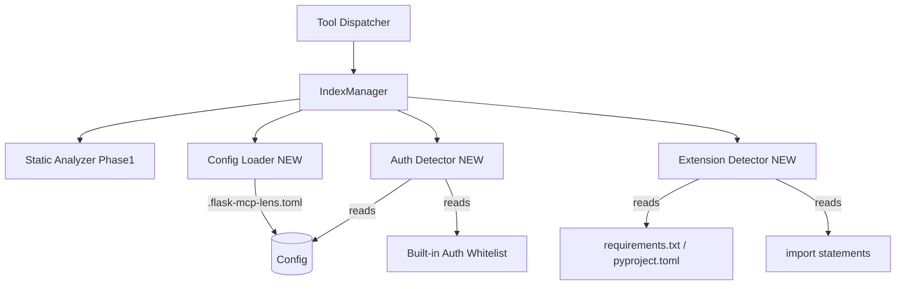
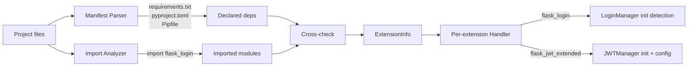

# flask-mcp-lens Phase 2 設計書（認証・拡張対応）

ステータス: ドラフト v1.0
対応要件: [requirements.md](./requirements.md) §3.3, §5.2, §5.4, §9 Phase 2
前提: [design-phase1.md](./design-phase1.md) の構造を踏襲
想定工数: 4 人日

---

## 目次

- [1. スコープと差分](#1-スコープと差分)
- [2. アーキテクチャ拡張](#2-アーキテクチャ拡張)
- [3. データモデル追加](#3-データモデル追加)
- [4. 認証検出エンジン](#4-認証検出エンジン)
- [5. 拡張ライブラリ検出](#5-拡張ライブラリ検出)
- [6. 設定ファイル](#6-設定ファイル)
- [7. ツール仕様（追加分）](#7-ツール仕様追加分)
- [8. Phase 1 ツールへの拡張](#8-phase-1-ツールへの拡張)
- [9. テスト設計](#9-テスト設計)
- [10. マイグレーションとキャッシュ互換性](#10-マイグレーションとキャッシュ互換性)

---

## 1. スコープと差分

Phase 1 から追加されるツール:

| ツール | 用途 |
|--------|------|
| `list_blueprints()` | Blueprint 一覧（未登録検出を含む）|
| `list_extensions()` | 使用 Flask 拡張の検出 |
| `list_auth_strategies()` | 認証方式と適用範囲 |
| `find_potentially_unprotected_routes()` | 認証漏れ候補（信頼度スコア付き）|
| `list_api_endpoints()` | API エンドポイント抽出 |
| `get_extension_config(name)` | 拡張設定の詳細（Flask-Login, Flask-JWT-Extended のみ）|

Phase 1 ツールへの拡張:

- `get_app_overview` の `auth_strategies_summary` と `extensions_detected` を実値で返す
- `list_routes` のレスポンスに `auth_signal` フィールドを追加
- `MethodView` / `View.as_view` 対応を ASTVisitor に追加

**Out of Phase 2**: ハイブリッド実行、`get_extension_config` の他拡張対応（SQLAlchemy, RESTful, RESTX）、プラグイン機構、watchdog。

---

## 2. アーキテクチャ拡張



**新規モジュール**:

| モジュール | 責務 |
|-----------|------|
| `flask_mcp_lens.auth.detector` | 認証シグナル収集と信頼度判定 |
| `flask_mcp_lens.auth.whitelist` | 既知デコレータ/関数名リスト |
| `flask_mcp_lens.extensions.detector` | 拡張検出本体 |
| `flask_mcp_lens.extensions.handlers/` | 拡張ごとの解析（`flask_login.py` 等）|
| `flask_mcp_lens.config` | `.flask-mcp-lens.toml` ローダ |
| `flask_mcp_lens.tools/list_blueprints.py` | 新ツール群 |
| `flask_mcp_lens.tools/...` (5 種) | 同上 |

---

## 3. データモデル追加

`models.py` に追加する dataclass:

```python
from typing import Literal

AuthConfidence = Literal["high", "medium", "low", "none"]

@dataclass(frozen=True)
class AuthSignal:
    kind: Literal["decorator", "before_request_abort", "function_name_heuristic", "user_declared"]
    name: str             # 検出されたデコレータ名 / 関数名
    location: SourceLoc
    confidence: AuthConfidence

@dataclass(frozen=True)
class RouteAuthEvaluation:
    route_endpoint: str   # Route.endpoint への参照
    signals: tuple[AuthSignal, ...]
    max_confidence: AuthConfidence

@dataclass(frozen=True)
class ExtensionInfo:
    name: str             # "flask_login"
    package: str          # "Flask-Login"
    declared_in: tuple[str, ...]   # "requirements.txt", "pyproject.toml"
    imported_in: tuple[SourceLoc, ...]
    initialized_at: Optional[SourceLoc]   # LoginManager() の位置等
    confidence: Literal["high", "medium", "low"]
    config: dict          # 拡張ごとに構造が違う、free-form

@dataclass(frozen=True)
class BlueprintRegistrationStatus:
    blueprint: str
    status: Literal["registered", "registered_dynamic", "unregistered"]
    locations: tuple[SourceLoc, ...]
```

`RouteIndex` に追加するフィールド:

```python
@dataclass(frozen=True)
class RouteIndex:
    # ... Phase 1 のフィールド ...
    schema_version: str = "2"      # 1 → 2 にバンプ
    auth_evaluations: tuple[RouteAuthEvaluation, ...]
    extensions: tuple[ExtensionInfo, ...]
    blueprint_status: tuple[BlueprintRegistrationStatus, ...]
```

---

## 4. 認証検出エンジン

### 4.1 ホワイトリスト

`auth/whitelist.py`:

```python
BUILTIN_AUTH_DECORATORS = frozenset({
    # Flask-Login
    "login_required", "fresh_login_required",
    # Flask-JWT-Extended
    "jwt_required", "jwt_optional",
    # Flask-Security
    "auth_required", "auth_token_required", "roles_required", "roles_accepted",
    "permissions_required", "permissions_accepted",
    # Flask-OIDC
    "oidc_auth", "require_login",
    # Flask-Principal
    "permission_required",
    # 一般的命名
    "require_auth", "requires_auth", "authenticated", "requires_login",
    "login_required_api",
})

AUTH_FUNCTION_NAME_PATTERNS = frozenset({
    "auth", "permission", "authenticate", "authorize", "check_login",
    "require_auth", "verify_token", "validate_session",
})
```

### 4.2 検出ロジック

`AuthDetector.evaluate(route, hooks, config) -> RouteAuthEvaluation`:

```python
def evaluate(route, hooks_by_scope, config):
    signals = []

    # 1. デコレータマッチ (high)
    decorator_set = BUILTIN_AUTH_DECORATORS | set(config.auth.extra_decorators)
    blacklist = set(config.auth.blacklist_decorators)
    for d in route.view.decorators:
        bare_name = d.name.split(".")[-1]
        if bare_name in blacklist:
            continue
        if bare_name in decorator_set:
            kind = "user_declared" if bare_name in config.auth.extra_decorators else "decorator"
            signals.append(AuthSignal(kind, d.name, d.location, "high"))

    # 2. before_request 内の abort(401/403) (medium)
    applicable_hooks = hooks_by_scope["app"] + hooks_by_scope.get(f"blueprint:{route.blueprint}", [])
    for hook in applicable_hooks:
        if hook.contains_abort_401_or_403:   # AST visitor で事前検出
            signals.append(AuthSignal("before_request_abort", hook.function_name, hook.location, "medium"))

    # 3. ユーザー定義関数の名前ヒューリスティック (low)
    for d in route.view.decorators:
        bare_name = d.name.split(".")[-1].lower()
        if any(pat in bare_name for pat in AUTH_FUNCTION_NAME_PATTERNS):
            if bare_name not in decorator_set and bare_name not in blacklist:
                signals.append(AuthSignal("function_name_heuristic", d.name, d.location, "low"))

    # 4. 設定ファイル明示宣言 (high)
    for func_name in config.auth.extra_functions:
        # 関数本体内で呼び出されているか（Phase 2 では view 関数の body を簡易検査）
        if route.view.calls_function(func_name):
            signals.append(AuthSignal("user_declared", func_name, route.view.location, "high"))

    max_conf = max([s.confidence for s in signals], default="none", key=_confidence_rank)
    return RouteAuthEvaluation(route.endpoint, tuple(signals), max_conf)
```

`view.calls_function(name)` のために ASTVisitor は view 関数本体の `Call.func` 名を集めておく（軽量、view 関数あたり数十ノード程度）。

### 4.3 偽陽性/偽陰性の制御

| ケース | 対応 |
|--------|------|
| 認証ラッパーが `@auth.login_required` のように属性アクセス経由 | `bare_name` だけで判定するため拾える |
| デコレータがファクトリ呼び出し `@require_role("admin")` | `Decorator.name` を `require_role` として記録、ホワイトリスト一致 |
| `before_request` の abort が条件分岐内 | Phase 2 では条件分岐の中身は問わず「abort 401/403 が登場すれば medium」と判定。ユーザー設定で blacklist 可能 |
| view 関数内で手動 `if not current_user: abort(401)` | デコレータ判定では拾えない。Phase 3 で view 本体スキャンを追加候補 |
| ホワイトリスト名と被るが認証ではない関数（例: ユーザー作成の `permission_check_view`）| `[auth.blacklist_functions]` で除外 |

---

## 5. 拡張ライブラリ検出

### 5.1 検出フロー



### 5.2 Manifest Parser

対応マニフェスト（優先順）:

1. `pyproject.toml` の `[project.dependencies]`, `[tool.poetry.dependencies]`, `[tool.uv.dependencies]`
2. `requirements.txt`, `requirements/*.txt`
3. `Pipfile` の `[packages]`

**ライブラリ**: 標準 `tomllib` (Python 3.11+) を使う。3.10 のみ `tomli` を依存に追加する。

**正規化**: パッケージ名は PEP 503 の正規化（`Flask_Login`, `flask-login`, `FLASK-LOGIN` → `flask-login`）。

### 5.3 既知拡張マッピング

`extensions/handlers/__init__.py`:

```python
KNOWN_EXTENSIONS = {
    "flask-login":          ("flask_login", FlaskLoginHandler),
    "flask-jwt-extended":   ("flask_jwt_extended", FlaskJWTExtendedHandler),
    # Phase 3 で追加
    # "flask-sqlalchemy":     ("flask_sqlalchemy", FlaskSQLAlchemyHandler),
    # "flask-restful":        ("flask_restful", FlaskRestfulHandler),
    # "flask-restx":          ("flask_restx", FlaskRestXHandler),
}
```

### 5.4 各 Handler の責務

`ExtensionHandler` 基底クラス:

```python
class ExtensionHandler:
    package_name: str
    import_name: str

    def detect_initialization(self, ast_results) -> Optional[SourceLoc]:
        """LoginManager() / JWTManager() 等の初期化位置"""
        ...

    def collect_config(self, ast_results) -> dict:
        """各種 setattr / decorator 等から設定を集める"""
        ...
```

**FlaskLoginHandler** が集める設定:

- `login_view`（`login_manager.login_view = "..."` 代入から）
- `login_message`
- `@login_manager.user_loader` で装飾された関数の位置
- `@login_manager.unauthorized_handler` の位置
- `@login_manager.request_loader` の位置

**FlaskJWTExtendedHandler** が集める設定:

- `JWTManager(app)` の初期化位置
- `JWT_SECRET_KEY` / `JWT_ACCESS_TOKEN_EXPIRES` 等の設定（`app.config[...] = ...` から）
- `@jwt.user_identity_loader`, `@jwt.user_lookup_loader` の位置

**信頼度判定**:

- declared_in と imported_in の両方あり → high
- どちらか片方のみ → medium
- 初期化位置が見つからない（import だけ）→ low に降格

---

## 6. 設定ファイル

### 6.1 配置と形式

**ファイル**: `<project_root>/.flask-mcp-lens.toml`
**形式**: TOML
**任意**: 存在しなくても動く（既定値で動作）

**スキーマ**:

```toml
[auth]
# ホワイトリストに追加するデコレータ名（@つけない）
extra_decorators = ["my_auth_required", "company_login_required"]
# ブラックリスト（誤検知排除）
blacklist_decorators = ["permission_check_view"]
# 関数名（view 内で呼ばれていれば認証扱い）
extra_functions = ["check_user_session"]
blacklist_functions = []

[scan]
# 追加除外グロブ
exclude = ["legacy/**", "scripts/oneoff/*.py"]
# 追加除外ディレクトリ名
exclude_dirs = ["vendor"]

[hybrid]
# Phase 3 で使用、Phase 2 では未使用（パースのみ）
enabled = false
```

### 6.2 Loader

`config.py`:

```python
@dataclass
class AuthConfig:
    extra_decorators: list[str] = field(default_factory=list)
    blacklist_decorators: list[str] = field(default_factory=list)
    extra_functions: list[str] = field(default_factory=list)
    blacklist_functions: list[str] = field(default_factory=list)

@dataclass
class ScanConfig:
    exclude: list[str] = field(default_factory=list)
    exclude_dirs: list[str] = field(default_factory=list)

@dataclass
class Config:
    auth: AuthConfig = field(default_factory=AuthConfig)
    scan: ScanConfig = field(default_factory=ScanConfig)
    hybrid: dict = field(default_factory=dict)   # Phase 3 で実装

    @classmethod
    def load(cls, project_root: Path) -> "Config":
        path = project_root / ".flask-mcp-lens.toml"
        if not path.exists():
            return cls()
        # 不明キーは warning（将来追加への耐性）
        ...
```

**`pyproject.toml` の `[tool.flask-mcp-lens]` 案について**: 要件 §10 でユーザー判断保留中。**暫定実装**: 両方読んで `[tool.flask-mcp-lens]` が存在すればそれを使い、なければ `.flask-mcp-lens.toml`。両方あれば warning + 後者優先。

---

## 7. ツール仕様（追加分）

### 7.1 `list_blueprints`

**入力**: なし
**出力**:

```jsonc
{
  "data": {
    "blueprints": [
      {
        "name": "users_api",
        "definition": { "file": "app/api/users.py", "line": 12 },
        "url_prefix": "/users",
        "parent": "api_v1",
        "effective_url_prefix": "/api/v1/users",
        "status": "registered",
        "registrations": [
          { "file": "app/api/__init__.py", "line": 5, "url_prefix_override": null }
        ],
        "route_count": 8
      },
      {
        "name": "admin_bp",
        "definition": { "file": "app/blueprints/admin.py", "line": 3 },
        "url_prefix": "/admin",
        "parent": null,
        "effective_url_prefix": null,
        "status": "unregistered",
        "registrations": [],
        "route_count": 4
      }
    ],
    "total": 2,
    "unregistered_count": 1
  }
}
```

**`status` の判定**:

- `registered`: `register_blueprint(<bp>)` が静的に検出された
- `registered_dynamic`: `register_blueprint(blueprints_list[i])` のような動的呼び出し範囲内に該当 BP が含まれる可能性がある場合（warning 付き）
- `unregistered`: いずれの登録呼び出しにも該当しない

### 7.2 `list_extensions`

**出力**:

```jsonc
{
  "data": {
    "extensions": [
      {
        "name": "flask_login",
        "package": "Flask-Login",
        "declared_in": ["requirements.txt"],
        "imported_in": [{"file": "app/__init__.py", "line": 5}],
        "initialized_at": {"file": "app/__init__.py", "line": 24},
        "confidence": "high",
        "config_available": true       // get_extension_config で詳細取得可
      }
    ],
    "unsupported_detected": [
      {"package": "flask-admin", "reason": "ハンドラ未実装"}
    ]
  }
}
```

### 7.3 `list_auth_strategies`

**出力**:

```jsonc
{
  "data": {
    "strategies": [
      {
        "kind": "decorator",
        "name": "jwt_required",
        "source_extension": "flask_jwt_extended",
        "applied_routes_count": 23,
        "applied_routes": [/* route endpoint 名のリスト、最大 50 */]
      },
      {
        "kind": "before_request",
        "name": "check_csrf",
        "scope": "blueprint:web",
        "applied_routes_count": 12
      }
    ]
  }
}
```

### 7.4 `find_potentially_unprotected_routes`

**入力**: なし
**出力**:

```jsonc
{
  "data": {
    "definitely_unprotected": [
      {
        "url": "/health",
        "methods": ["GET"],
        "endpoint": "main.health",
        "definition": {"file": "app/views.py", "line": 10},
        "rationale": "認証シグナル一切なし（デコレータなし、before_request スコープに abort 401/403 なし）"
      }
    ],
    "likely_unprotected": [
      {
        "url": "/internal/debug",
        "endpoint": "main.debug",
        "rationale": "関数名ヒューリスティックのみ: @debug_check（true authorization か不明）",
        "signals": [{"kind": "function_name_heuristic", "name": "debug_check", "confidence": "low"}]
      }
    ],
    "ambiguous": [
      {
        "url": "/api/users",
        "endpoint": "users_api.list_users",
        "rationale": "blueprint スコープの before_request `check_token` で abort(401) を検出したが、適用範囲が動的 (条件分岐内)",
        "signals": [{"kind": "before_request_abort", "name": "check_token", "confidence": "medium"}]
      }
    ],
    "summary": {
      "total_routes": 87,
      "definitely_unprotected": 1,
      "likely_unprotected": 1,
      "ambiguous": 1,
      "high_confidence_protected": 84
    }
  }
}
```

### 7.5 `list_api_endpoints`

**入力**:

```jsonc
{
  "type": "object",
  "properties": {
    "include": {
      "type": "array",
      "items": {"enum": ["json_response", "url_prefix_api", "restful", "restx"]}
    }
  }
}
```

省略時は全シグナル。

**判定シグナル**:

- `json_response`: view 関数本体に `jsonify(...)` 呼び出しまたは `return ..., {"Content-Type": "application/json"}` を含む
- `url_prefix_api`: route.url が `/api`, `/v1`, `/api/v1` 等で始まる（設定で `[api.url_prefixes]` 上書き可能）
- `restful`: Flask-RESTful の `Api(app).add_resource(...)` で登録（Phase 3 で完全対応、Phase 2 ではプレースホルダ）
- `restx`: 同上

**出力**:

```jsonc
{
  "data": {
    "endpoints": [
      {
        "url": "/api/v1/users/<int:id>",
        "methods": ["GET"],
        "endpoint": "users_api.get_user",
        "matched_signals": ["json_response", "url_prefix_api"]
      }
    ],
    "total": 45
  }
}
```

### 7.6 `get_extension_config`

**入力**:

```jsonc
{
  "type": "object",
  "properties": {
    "name": {"type": "string", "enum": ["flask_login", "flask_jwt_extended"]}
  },
  "required": ["name"]
}
```

**出力（`flask_login` の例）**:

```jsonc
{
  "data": {
    "name": "flask_login",
    "initialized_at": {"file": "app/__init__.py", "line": 24},
    "config": {
      "login_view": "auth.login",
      "login_message": "Please log in",
      "user_loader": {"function": "load_user", "location": {"file": "app/auth.py", "line": 12}},
      "unauthorized_handler": {"function": "unauthorized", "location": {"file": "app/auth.py", "line": 30}},
      "request_loader": null
    }
  }
}
```

存在しない拡張名 → `{"error": "extension not found or not yet supported"}`。

---

## 8. Phase 1 ツールへの拡張

### 8.1 `get_app_overview` の更新

```jsonc
{
  "data": {
    "app_factory": {...},
    "blueprint_count": 12,
    "registered_blueprint_count": 10,    // NEW
    "unregistered_blueprint_count": 2,    // NEW
    "route_count": 87,
    "extensions_detected": ["flask_login", "flask_jwt_extended"],
    "auth_strategies_summary": {
      "decorator_based": 2,
      "before_request_based": 1,
      "high_confidence_protected_routes": 70,
      "definitely_unprotected_routes": 5,
      "ambiguous_routes": 3
    },
    "summary_markdown": "..."
  }
}
```

### 8.2 `list_routes` への `auth_signal` 追加

```jsonc
{
  "url": "/api/v1/users/<int:id>",
  "methods": ["GET"],
  "endpoint": "users_api.get_user",
  "view_function": "get_user",
  "blueprint": "users_api",
  "definition": {...},
  "decorators": ["jwt_required"],
  "auth_signal": {                      // NEW
    "max_confidence": "high",
    "primary_kind": "decorator",
    "primary_name": "jwt_required"
  }
}
```

### 8.3 `MethodView` / `View.as_view` 対応

ASTVisitor 拡張:

- `class FooView(MethodView):` を検出し、`get`, `post`, `put`, `delete`, `patch` メソッドを各 method の handler とする
- `app.add_url_rule("/foo", view_func=FooView.as_view("foo"))` で endpoint と URL を結合
- 各 method を独立した `Route` として `RouteIndex` に登録
- デコレータは class レベル（`decorators = [...]` クラス変数）と method レベルの両方を集める

`Route.view.qualname` には `module.FooView.get` のようにクラス名を含む。

---

## 9. テスト設計

### 9.1 新 fixture

`tests/fixtures/full_app/` を追加:

- `create_app()` パターン
- Flask-Login + Flask-JWT-Extended 併用
- Blueprint 5 つ（うち 1 つ未登録）
- ルート総数 30 程度
- 認証パターンを意図的に多様化:
  - `@login_required` で保護
  - `@jwt_required()` で保護
  - 自作 `@require_admin` を `[auth.extra_decorators]` で宣言
  - `before_request` で `abort(401)` を実装した BP
  - `/health` のような明示的非保護ルート
- `MethodView` 例 1 つ
- `.flask-mcp-lens.toml` を同梱

### 9.2 ユニットテスト追加

| 対象 | 観点 |
|------|------|
| `auth.detector` | 各 confidence レベルの判定、blacklist 適用、設定オーバーライド |
| `extensions.detector` | declared/imported 不整合 (片方のみ) の confidence、unsupported 警告 |
| `extensions.handlers.flask_login` | `login_view`, `user_loader` 等の抽出 |
| `config.load` | 不明キー warning、両ファイル併存時の優先順 |
| `ast_visitor` (MethodView 部分) | `MethodView` サブクラス検出、method 別 endpoint |

### 9.3 統合テスト追加

- `find_potentially_unprotected_routes` の偽陽性率を fixture で計測（目標 30% 以下）
- 偽陰性ケース（`/health` を保護扱いしてしまわないか）の確認
- `get_app_overview` の `auth_strategies_summary` 整合性

### 9.4 偽陽性率の計測方法

`tests/eval/test_auth_precision.py`:

```python
def test_unprotected_precision():
    # full_app fixture で人手でラベル付けした「真の未保護ルート」リスト
    truth = load_truth("tests/eval/truth_full_app.yaml")
    result = call_tool("find_potentially_unprotected_routes")
    flagged = result["definitely_unprotected"] + result["likely_unprotected"]
    false_positives = [r for r in flagged if r["endpoint"] not in truth["unprotected"]]
    precision = 1 - len(false_positives) / max(len(flagged), 1)
    assert precision >= 0.7    # 偽陽性率 30% 以下 == precision 70% 以上
```

`tests/eval/truth_full_app.yaml` に「unprotected: [endpoint, ...]」を人手記述。

---

## 10. マイグレーションとキャッシュ互換性

`schema_version` を `"1"` → `"2"` に更新。Phase 1 で生成されたキャッシュは `_is_valid()` でバージョン不一致により破棄され、自動でリビルドされる。ユーザー操作不要。

`RouteIndex` への新フィールド追加だけなので、Phase 1 の解析結果との論理的整合性は保たれる（既存フィールドの意味は変わらない）。
