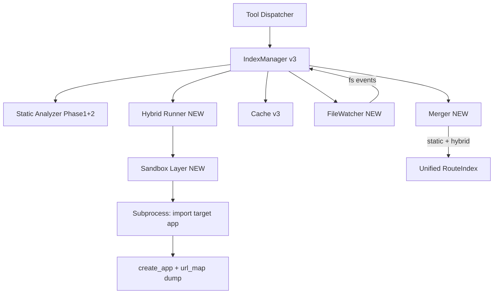
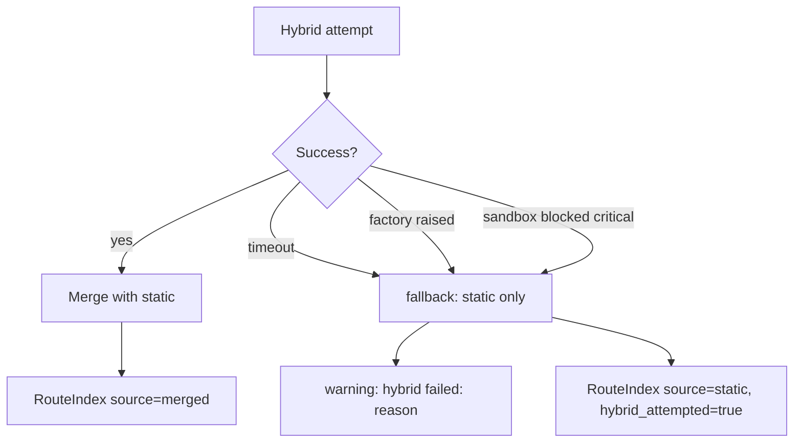

# flask-mcp-lens Phase 3 設計書（ハイブリッド解析・自動更新）

ステータス: ドラフト v1.0
対応要件: [requirements.md](./requirements.md) §5.1, §5.2 (拡張追加), §9 Phase 3
前提: [design-phase1.md](./design-phase1.md), [design-phase2.md](./design-phase2.md) を踏襲
想定工数: 5 人日

---

## 目次

- [1. スコープ](#1-スコープ)
- [2. 全体アーキテクチャ](#2-全体アーキテクチャ)
- [3. ハイブリッド実行サブシステム](#3-ハイブリッド実行サブシステム)
- [4. 副作用抑止層](#4-副作用抑止層)
- [5. 静的×ハイブリッドのマージ戦略](#5-静的ハイブリッドのマージ戦略)
- [6. 失敗時のフォールバック](#6-失敗時のフォールバック)
- [7. watchdog 統合](#7-watchdog-統合)
- [8. 差分再解析](#8-差分再解析)
- [9. 拡張ハンドラ追加（SQLAlchemy / RESTful / RESTX）](#9-拡張ハンドラ追加sqlalchemy--restful--restx)
- [10. ツール仕様（追加・変更）](#10-ツール仕様追加変更)
- [11. テスト設計](#11-テスト設計)
- [12. セキュリティ通告とドキュメント](#12-セキュリティ通告とドキュメント)
- [13. キャッシュ互換性](#13-キャッシュ互換性)

---

## 1. スコープ

Phase 3 で追加されるもの:

| 項目 | 用途 |
|------|------|
| ハイブリッド実行（オプトイン） | `create_app()` を実行して `app.url_map` 等から動的解決を取得 |
| 副作用抑止層 | DB 接続、外部通信、ファイル書き込みのブロック |
| ファイル変更検知 (watchdog) | `--watch` フラグで自動 invalidate |
| 差分再解析 | 変更ファイルのみ再解析、依存伝搬 |
| 拡張ハンドラ追加 | Flask-SQLAlchemy, Flask-RESTful, Flask-RESTX |
| 設定 `[hybrid]` セクションの完全実装 | Phase 2 でパースだけしていた箇所を実用化 |

**Out of Phase 3**: プラグイン機構、並列解析、HTTP/SSE transport、複数 app 構成。

---

## 2. 全体アーキテクチャ



**プロセスモデル**:

- 静的解析: 本体プロセス内（従来通り）
- ハイブリッド実行: **別プロセス（subprocess）**として起動。本体プロセスを副作用から守る
- watchdog: 本体プロセス内のスレッド（`Observer`）

**新規モジュール**:

| モジュール | 責務 |
|-----------|------|
| `flask_mcp_lens.hybrid.runner` | subprocess の起動、stdout/stderr 収集 |
| `flask_mcp_lens.hybrid.probe` | subprocess 内で動く子スクリプト本体 |
| `flask_mcp_lens.hybrid.sandbox` | 副作用抑止のための monkey patch ヘルパ |
| `flask_mcp_lens.hybrid.merger` | 静的結果とハイブリッド結果のマージ |
| `flask_mcp_lens.watch.observer` | watchdog ベースのファイル監視 |
| `flask_mcp_lens.cache.delta` | ファイル単位差分の管理 |
| `flask_mcp_lens.extensions.handlers.flask_sqlalchemy` | DB モデル/エンジン検出 |
| `flask_mcp_lens.extensions.handlers.flask_restful` | Resource 登録検出 |
| `flask_mcp_lens.extensions.handlers.flask_restx` | Namespace 検出 |

---

## 3. ハイブリッド実行サブシステム

### 3.1 起動条件

以下を**すべて満たす**場合のみ実行:

1. `.flask-mcp-lens.toml` に `[hybrid] enabled = true`
2. プロジェクトに `find_app_factory()` で `create_app` または同等が検出されている
3. `[hybrid]` セクションに必要な設定が揃っている（`factory_args` が必要な場合）

いずれかを満たさなければ静的解析のみで動作（warning 等は出さない、明示オプトインのため）。

### 3.2 設定スキーマ

```toml
[hybrid]
enabled = true

# create_app() の探索オーバーライド（自動検出で間違ったものが選ばれた場合）
factory_module = "myapp"          # python -c "from <factory_module> import create_app"
factory_function = "create_app"

# create_app() への引数
[hybrid.factory_args]
config_name = "testing"           # create_app(config_name="testing")

# 環境変数注入（実行時に os.environ に追加）
[hybrid.env]
FLASK_ENV = "testing"
TESTING = "true"

# 設定キー上書き（app.config[key] = value を強制）
[hybrid.config_overrides]
SQLALCHEMY_DATABASE_URI = "sqlite:///:memory:"
CELERY_BROKER_URL = "memory://"
REDIS_URL = "redis://localhost:9999/0"   # ブロック層が遮断するため到達しない

# タイムアウト
timeout_seconds = 20

# 実行ポリシー
allow_network = false             # default false。true でも警告
allow_subprocess_exec = false     # subprocess.Popen 等の実行
```

### 3.3 サブプロセス実行

`hybrid/runner.py`:

```python
def run_hybrid(project_root: Path, config: HybridConfig) -> HybridResult | HybridError:
    probe_script = Path(__file__).parent / "probe.py"
    cmd = [sys.executable, str(probe_script)]
    env = build_env(project_root, config)
    try:
        proc = subprocess.run(
            cmd,
            cwd=project_root,
            env=env,
            timeout=config.timeout_seconds,
            input=json.dumps(config.to_dict()),
            text=True,
            capture_output=True,
        )
    except subprocess.TimeoutExpired as e:
        return HybridError(reason="timeout", detail=str(e))
    if proc.returncode != 0:
        return HybridError(reason="nonzero_exit", detail=proc.stderr[-2000:])
    return HybridResult.parse(proc.stdout)
```

### 3.4 Probe スクリプト (`hybrid/probe.py`)

subprocess の中で実行される。本体プロセスとは独立。

```python
def main():
    config = json.loads(sys.stdin.read())
    sandbox.install(config)               # monkey patches before any user import
    sys.path.insert(0, config["project_root"])
    factory_module = importlib.import_module(config["factory_module"])
    factory = getattr(factory_module, config["factory_function"])
    try:
        app = factory(**config.get("factory_args", {}))
    except Exception as e:
        emit_error("factory_call_failed", e)
        sys.exit(1)
    apply_config_overrides(app, config.get("config_overrides", {}))
    payload = dump_app(app)               # url_map, blueprints, before_request_funcs, extensions
    sys.stdout.write(json.dumps(payload))
```

### 3.5 `dump_app` の出力

```python
{
    "url_map": [
        {
            "rule": "/api/v1/users/<int:id>",
            "methods": ["GET", "DELETE"],
            "endpoint": "users_api.get_user",
            # 静的解析と紐付けるため
            "view_func_module": "myapp.api.users",
            "view_func_qualname": "get_user"
        }
    ],
    "blueprints": [
        {
            "name": "users_api",
            "url_prefix": "/users",
            # register_blueprint(...) で確定した url_prefix
        }
    ],
    "before_request_funcs": {
        "app": [
            {"qualname": "myapp.load_user", "module": "myapp"}
        ],
        "blueprint:users_api": [
            {"qualname": "myapp.api.users.check_token"}
        ]
    },
    "extensions_initialized": ["flask_login", "flask_sqlalchemy"]
}
```

---

## 4. 副作用抑止層

`hybrid/sandbox.py`：probe スクリプトの最初に呼ぶ `install(config)` で以下を実施。

### 4.1 ネットワーク遮断

```python
import socket
_original_create_connection = socket.create_connection
_allowed_hosts = {"localhost", "127.0.0.1", "::1"} if config["allow_network"] else set()

def _patched_create_connection(address, *args, **kwargs):
    host, port = address
    if host not in _allowed_hosts:
        raise BlockedNetworkError(f"network access blocked: {host}:{port}")
    return _original_create_connection(address, *args, **kwargs)

socket.create_connection = _patched_create_connection
```

`socket.socket.connect` も同様にラップ。`urllib`, `requests`, `httpx` は内部で `socket` を使うため、低層遮断で全て止まる。

### 4.2 DB エンジン強制

`Flask-SQLAlchemy` を import 後、`SQLALCHEMY_DATABASE_URI` を `sqlite:///:memory:` で上書き。
それでも実 DB に繋ごうとする呼び出し（`psycopg2.connect` 等）は `socket` 遮断で失敗する。

### 4.3 subprocess 遮断

```python
import subprocess
_original_popen = subprocess.Popen
def _blocked_popen(*args, **kwargs):
    if not config.get("allow_subprocess_exec"):
        raise BlockedSubprocessError(f"subprocess execution blocked: {args}")
    return _original_popen(*args, **kwargs)
subprocess.Popen = _blocked_popen
```

`os.system`, `os.popen` も同様にラップ。

### 4.4 ファイル書き込み制御

`open(..., "w"/"a"/"x")` の path がプロジェクトルート外なら `BlockedWriteError`。
プロジェクトルート内（`.flask-mcp-lens/cache/` 等への意図しない書き込みを除く）は許容。

**判断**: プロジェクト内書き込みの全面ブロックは過剰（ログファイル生成等で正当な書き込みもある）。ルート外書き込みのみ阻止。

### 4.5 シグナル無視

`signal.signal(SIGTERM, ...)` 等のハンドラ登録は許可（無視できないシグナルは subprocess 終了で消える）。

### 4.6 `BlockedXxxError` の扱い

probe 内で発生したら `stderr` に「ハイブリッド実行中にネットワーク遮断: <ホスト>」を書いて continue（DB 接続は遅延される設計が多いため、import 時点で死ぬとは限らない）。本当に factory が完了しなければエラー終了。

---

## 5. 静的×ハイブリッドのマージ戦略

`hybrid/merger.py`:

```python
def merge(static_index: RouteIndex, hybrid_result: HybridResult) -> RouteIndex:
    ...
```

**マージ規則**（フィールドごと）:

| フィールド | マージ戦略 | 根拠 |
|-----------|-----------|------|
| `routes.url` | ハイブリッド優先 | `app.url_map` が真実 |
| `routes.methods` | ハイブリッド優先 | 同上 |
| `routes.endpoint` | ハイブリッド優先 | 同上 |
| `routes.definition` (file/line) | 静的優先 | ハイブリッドは取れない |
| `routes.view.decorators` | 静的優先 | ハイブリッドは取れない |
| `blueprints.url_prefix` | ハイブリッド優先 | 動的解決が反映される |
| `blueprints.status` | ハイブリッド「登録あり」/「登録なし」が確定値 | 静的の `registered_dynamic` を確定値に置換 |
| `before_request_hooks` | 和集合 | 静的で見つからなかった動的登録を補完 |
| `extensions` | ハイブリッド「初期化された」を確定 | 静的で `confidence: medium` だったものが high に |

**紐付けキー**: 静的解析の `Route.view.qualname` と、ハイブリッドの `view_func_module + "." + view_func_qualname` で結合。一致しないものは静的のみ or ハイブリッドのみで保持し、warning を出す。

```python
def correlate(static_routes, hybrid_routes):
    by_qualname = {r.view.qualname: r for r in static_routes}
    merged = []
    hybrid_only = []
    for h in hybrid_routes:
        key = f"{h['view_func_module']}.{h['view_func_qualname']}"
        if key in by_qualname:
            merged.append(combine(by_qualname.pop(key), h))
        else:
            hybrid_only.append(h)
    static_only = list(by_qualname.values())
    return merged, hybrid_only, static_only
```

`hybrid_only` は「動的に追加されたが静的には見えないルート」、`static_only` は「条件で実行されなかったコードパス」を示す。両方とも `RouteIndex.routes` に含めるが、`source` フィールド（`"static" | "hybrid" | "merged"`）で識別可能にする。

---

## 6. 失敗時のフォールバック



**warning 例**:

- `"ハイブリッド解析失敗 (timeout 20s): 静的解析のみの結果を返します"`
- `"ハイブリッド解析失敗 (factory_call_failed: KeyError 'DB_PASSWORD'): factory_args の設定を確認してください"`

**`analysis_mode` フィールド**: ツールレスポンスの `analysis_mode` を `"static"` / `"hybrid"` / `"merged"` の 3 値に拡張。フォールバック時は `"static"` で `warnings` にハイブリッド失敗を含める。

**ユーザーへの通知**: 失敗が続くプロジェクトでは `[hybrid] enabled = false` 推奨を warning に含める。

---

## 7. watchdog 統合

### 7.1 起動

CLI フラグ `--watch` で有効。デフォルト無効（依存と CPU を増やすため）。

```bash
flask-mcp-lens --root /path/to/project --watch
```

### 7.2 監視範囲

- プロジェクトルート配下の `*.py` のみ
- 除外ディレクトリは Scanner と同じ
- `.flask-mcp-lens.toml` の変更も監視（変更で全体 invalidate）

### 7.3 イベント処理

```python
class FlaskWatchHandler(FileSystemEventHandler):
    def __init__(self, index_manager):
        self.im = index_manager
        self._debounce = Debouncer(interval_ms=500)

    def on_modified(self, event):
        if not event.is_directory and event.src_path.endswith(".py"):
            rel = make_relative(event.src_path)
            if not is_excluded(rel):
                self._debounce(self.im.mark_dirty, rel)

    def on_created(self, event): ...      # 新規ファイル → mark_dirty
    def on_deleted(self, event): ...      # 削除 → 該当 Route を index から除去
    def on_moved(self, event): ...        # rename → 旧/新両方 mark_dirty
```

**Debounce**: 500ms 間隔で同一ファイルへの連続イベントを 1 回にまとめる。エディタの保存時に複数 fsevent が出るため。

### 7.4 IndexManager の状態

```python
class IndexManager:
    def __init__(self):
        self._index: RouteIndex | None = None
        self._dirty_files: set[str] = set()
        self._lock = threading.Lock()

    def mark_dirty(self, file_rel: str):
        with self._lock:
            self._dirty_files.add(file_rel)

    def get(self) -> RouteIndex:
        with self._lock:
            if self._index is None:
                self._index = self._full_build()
            elif self._dirty_files:
                self._index = self._delta_rebuild(self._dirty_files)
                self._dirty_files.clear()
            return self._index
```

ツール呼び出し時に dirty があれば差分再解析を実行（lazy 評価）。watchdog 自身は再解析を起こさない（無音 CPU を防ぐ）。

---

## 8. 差分再解析

### 8.1 ファイル単位 RawNodes

Phase 1 では Resolver が全ファイル分の RawNodes を集約するモノリシック処理だった。Phase 3 では:

```python
@dataclass
class FileAnalysis:
    file: str
    mtime: float
    raw_nodes: RawNodes
    # 横断参照のためのメタ
    defines_blueprints: tuple[str, ...]
    references_blueprints: tuple[str, ...]
    defines_app_factory: bool
```

`IndexManager` は `dict[file, FileAnalysis]` をキャッシュ。

### 8.2 差分再解析アルゴリズム

```python
def _delta_rebuild(self, dirty: set[str]) -> RouteIndex:
    affected = set(dirty)

    # 影響伝搬: dirty ファイルが Blueprint を定義していたら、
    # その Blueprint を register_blueprint しているファイルも再解析対象
    for f in dirty:
        old = self._file_analyses.get(f)
        if old is not None:
            for bp_name in old.defines_blueprints:
                affected |= self._files_referencing_blueprint(bp_name)

    # 各 affected ファイルを再 visit
    for f in affected:
        if not Path(f).exists():
            self._file_analyses.pop(f, None)
            continue
        self._file_analyses[f] = self._analyze_file(f)

    # Resolver を全 FileAnalysis で再実行（軽量なので allow）
    return self._resolver.resolve(self._file_analyses.values())
```

**伝搬の終端**: Blueprint 名を grep するレベルの軽量伝搬のみ。型推論まで踏み込まない。誤って広げすぎる場合は warning（「差分再解析が広範囲に及びました: 全体再解析を検討」）。

### 8.3 全体再解析へのフォールバック条件

- dirty ファイル数 > 全ファイルの 30%
- `.flask-mcp-lens.toml` が変更された
- `pyproject.toml` / `requirements.txt` が変更された（拡張依存が変わる可能性）
- スキーマバージョン不一致

---

## 9. 拡張ハンドラ追加（SQLAlchemy / RESTful / RESTX）

### 9.1 FlaskSQLAlchemyHandler

検出:

- `SQLAlchemy(app)` または `db = SQLAlchemy()` + `db.init_app(app)`
- `db.Model` を継承するクラス（テーブル名、主要カラム）

`get_extension_config("flask_sqlalchemy")` の出力:

```jsonc
{
  "data": {
    "name": "flask_sqlalchemy",
    "initialized_at": {"file": "app/extensions.py", "line": 5},
    "config": {
      "database_uri_source": "app.config['SQLALCHEMY_DATABASE_URI']",   // 値そのものは返さない（秘匿のため）
      "models": [
        {
          "class": "User",
          "tablename": "users",
          "file": "app/models/user.py",
          "line": 12,
          "columns": ["id", "email", "password_hash", "created_at"]    // 型は返さない（簡略化）
        }
      ],
      "model_count": 12
    }
  }
}
```

**秘匿**: 接続文字列の値（パスワード含む可能性）は返さず、参照位置のみ返す。

### 9.2 FlaskRestfulHandler

検出:

- `Api(app)` または `Api(blueprint)`
- `api.add_resource(ResourceClass, "/path", endpoint="...")`
- `Resource` サブクラスの `get`, `post`, `put`, `delete`, `patch` メソッド

各 Resource を `Route` として `RouteIndex.routes` に追加（`MethodView` と同様の扱い）。`view.qualname` は `module.ResourceClass.get`。

`list_api_endpoints` の `restful` シグナルがここで実装される。

### 9.3 FlaskRestXHandler

検出:

- `Api()` + `Namespace()`
- `@ns.route(...)` でデコレート
- `@ns.expect(...)`, `@ns.marshal_with(...)` のデコレータも記録

Resource の扱いは Flask-RESTful と同様。Namespace の階層は `url_prefix` 結合に反映。

---

## 10. ツール仕様（追加・変更）

### 10.1 新ツール `get_hybrid_status()`

**目的**: ハイブリッド実行の最後の試行結果を確認する。

**出力**:

```jsonc
{
  "data": {
    "enabled": true,
    "last_attempt_at": "2026-04-28T10:23:45Z",
    "last_attempt_outcome": "success",     // success / timeout / factory_failed / blocked / disabled
    "last_attempt_duration_ms": 1832,
    "last_warnings": [
      "ネットワーク遮断: redis://localhost:9999/0 への接続をブロックしました（無視して続行）"
    ],
    "merge_stats": {
      "static_routes": 87,
      "hybrid_routes": 89,
      "merged_routes": 87,
      "hybrid_only_routes": 2,
      "static_only_routes": 0
    }
  }
}
```

### 10.2 全ツールの `analysis_mode` 拡張

`"static"` / `"hybrid"` / `"merged"` の 3 値。`"hybrid"` は静的を完全に置き換えた場合（実装上は基本ない）、`"merged"` が両方使った場合。

### 10.3 `list_blueprints` の `status` 確定化

ハイブリッド成功時は `status: "registered"` か `status: "unregistered"` のみ。`registered_dynamic` は出ない。

### 10.4 `list_routes` への `source` フィールド追加

```jsonc
{
  "url": "/api/dynamic",
  "endpoint": "dynamic_bp.handler",
  "source": "hybrid_only",     // "static" / "merged" / "hybrid_only" / "static_only"
  ...
}
```

### 10.5 `find_potentially_unprotected_routes` への `source` 反映

`source: "hybrid_only"` のルートは「静的に追跡できない動的登録」なので、認証評価の信頼度は `medium` 以下に降格（demote）して `ambiguous` に分類する。理由: 静的には decorators が見えないため。

---

## 11. テスト設計

### 11.1 ハイブリッド fixture

`tests/fixtures/hybrid_app/`:

- 条件付き Blueprint 登録 (`if config['ENABLE_FOO']: app.register_blueprint(foo_bp)`)
- ループでの動的登録
- DB エンジン初期化
- Redis クライアント初期化（`socket` 遮断のテスト用）
- `.flask-mcp-lens.toml` で `[hybrid] enabled = true`、`[hybrid.factory_args]` 設定

### 11.2 サンドボックステスト

`tests/unit/test_sandbox.py`:

- `socket.create_connection` 遮断確認
- `subprocess.Popen` 遮断確認
- ルート外ファイル書き込み遮断確認
- `allow_network = true` で localhost のみ許可確認

### 11.3 タイムアウト/失敗テスト

- 無限ループする factory → timeout で停止
- 例外を投げる factory → エラー詳細をフォールバック warning に
- 環境変数不足 (`KeyError`) → factory_args 不足の suggestion

### 11.4 マージテスト

- 静的のみ取れるケース、ハイブリッドのみ取れるケース、両方取れるケースの混合 fixture
- `source` フィールドの正確性検証

### 11.5 watchdog 統合テスト

- subprocess で `--watch` 起動
- ファイルを書き換える
- 次のツール呼び出しで dirty 反映を検証
- debounce: 100ms 間に 5 回保存 → 再解析は 1 回のみ

### 11.6 性能テスト

- 5 万行プロジェクトで全体解析 30 秒以内（Phase 1 と同水準を保つ）
- 1 ファイル変更時の差分再解析 2 秒以内
- ハイブリッド完了時間（`hybrid_app` fixture で 5 秒以内）

---

## 12. セキュリティ通告とドキュメント

### 12.1 README への記載

明確な警告セクションを追加:

```markdown
## ⚠ ハイブリッドモードのセキュリティ

`[hybrid] enabled = true` を設定すると、flask-mcp-lens は **ターゲットプロジェクト
のコードを実際に実行します**（具体的には `create_app()` の呼び出し時点まで）。
これは事実上、信頼できないリポジトリでは `pip install` 後に未知のコードを実行する
のと同じリスクです。

### 推奨

- **信頼するリポジトリでのみ有効化**してください
- CI/自動化されたパイプライン上では既定で無効のままにしてください
- サンドボックス層はネットワーク・subprocess・ルート外書き込みを遮断しますが、
  完全な隔離ではありません
- 重要な秘密情報（本番 API キー等）が `.env` 経由で読み込まれる場合は、
  `[hybrid.env]` で空値に上書きしてください
```

### 12.2 起動時ログ

ハイブリッド有効プロジェクトを開いたとき、stderr に 1 度だけ出力:

```
[flask-mcp-lens] hybrid mode is ENABLED. The target application's create_app() will be executed in a subprocess.
[flask-mcp-lens] If this is an untrusted codebase, set `[hybrid] enabled = false` in .flask-mcp-lens.toml.
```

### 12.3 監査ログ

`.flask-mcp-lens/hybrid-runs.log` に各ハイブリッド試行を記録（時刻、結果、ブロックされたコール）。事故調査用。最大 100 件、ローテーション。

---

## 13. キャッシュ互換性

`schema_version` を `"2"` → `"3"` に更新。`RouteIndex` への追加フィールド:

- `routes[].source` (`"static"` / `"hybrid_only"` / `"static_only"` / `"merged"`)
- `analysis_metadata`: `{"hybrid_attempted": bool, "hybrid_outcome": str, ...}`
- `file_analyses`: 差分再解析用の per-file キャッシュ（別ファイル `.flask-mcp-lens/cache/file-analyses-v3.json.gz` に分離保存）

ハイブリッド実行結果はキャッシュしない（毎回 fresh に取る、コードが変わってなくても環境変数や DB 状態が違えば結果が変わるため）。静的解析結果のみキャッシュ。
